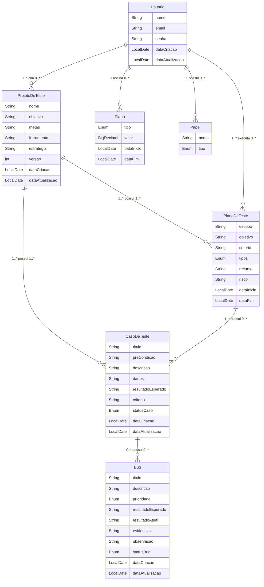

# Mind QA

Como analista de qualidade, desejo um sistema de gerenciamento de qualidade de software no qual eu possa elaborar planos de testes, criar casos de testes, executar casos de testes de forma manual e automatizada, reportar bugs, catalogar bugs e gerar relatórios sobre a criação dos casos de teste, execução, reports de bugs, correções e geração de projeto de testes automatizados com casos de testes pré-criados, tudo de forma simples e reutilizável.

## Histórico de Mudanças

| Data          | Autor  | Observação                           |
|---------------|--------|--------------------------------------|
| 10 de ago. de 2024 | Amilton | Criação da documentação               |
| 15 de ago. de 2024 | Amilton | Refatoração dos requisitos funcionais |

## Requisitos Funcionais

## Diagrama de Classes

### Criar Conta:
- Permitir que novos usuários se registrem no sistema fornecendo informações como nome, email (que deve ser único), senha e papel (Líder, Membro).
- Enviar um email de confirmação para ativar a conta.

### Planos de Assinatura:
- Deve haver 3 tipos de plano e seus valores:
  - Mensal: R$ 25.00
  - Trimestral: R$ 60.00
  - Anual: R$ 110.00

### Fazer Login:
- Permitir que usuários existentes façam login no sistema utilizando email e senha.
- Implementar recuperação de senha via email.

### Criar Projeto de Teste:
- Permitir que usuários criem novos projetos de teste, definindo o nome do projeto, objetivo, equipe, metas de teste, ferramentas e tecnologias que vão ser usadas, estratégia de teste, processo de teste e comunicação.
- Cada projeto deve ter opções para configuração de versões do software a serem testadas.

### Convidar Membros:
- Permitir que o proprietário do projeto convide outros usuários para participar do projeto.
- Definir permissões para os membros convidados (visualização, edição, execução de testes, etc.).

### Criar Plano de Teste:
- Permitir a criação de planos de teste, que incluem o objetivo, escopo, critérios de aceitação, tipos de testes, recursos necessários e riscos e mitigações.
- Associar planos de teste a ciclos específicos dentro de um projeto.

### Criar Casos de Teste:
- Permitir a criação de casos de teste detalhados, incluindo o id, título, pré-condições, descrição, dados que serão usados, resultados esperados, critérios de aceitação.
- Possibilitar a categorização de casos de teste por funcionalidade, prioridade e tipo de teste (funcional, regressão, etc.).

### Executar Casos de Teste:
- Permitir a execução manual de casos de teste, registrando os resultados como tempo de execução, status (aprovado, reprovado, bloqueado), evidência de teste e observação.
- Integrar com ferramentas de automação para execução automatizada de casos de teste.
- Armazenar o histórico de execução para cada ciclo de teste.

### Reportar Bugs:
- Permitir a criação de reportes de bugs detalhados, incluindo o id, título, severidade, prioridade, descrição, resultados esperados, resultado atual, evidências via capturas de tela ou logs, ambiente de teste como: ambiente, versão do sistema, browser ou dispositivo.
- Categorizar bugs por severidade e prioridade.

### Catalogar Bugs:
- Permitir a visualização, edição e rastreamento de bugs reportados, com filtros por status (novo, em andamento, resolvido, fechado) e severidade.
- Associar bugs a casos de teste e ciclos de teste específicos.

### Gerar Relatório:
- Permitir a geração de relatórios detalhados sobre a criação e execução de casos de teste, bugs reportados e correções aplicadas.
- Oferecer diferentes formatos de relatório (PDF, Excel) e a opção de personalizar as informações incluídas.

### Gerar Projeto de Teste Automatizado:
- Permitir a criação de projetos de teste automatizados com casos de teste pré-criados, exportando-os para ferramentas de automação como Jenkins ou GitHub Actions.
- Possibilitar a modificação dos casos de teste automatizados antes da execução, conforme necessário.

## Requisitos Não Funcionais

### Performance:
- O sistema deve ser capaz de lidar com até 1.000 usuários simultâneos sem degradação perceptível no desempenho.
- Resposta do sistema para criação e edição de casos de teste não deve exceder 2 segundos.
- A geração de relatórios deve ser concluída em até 5 segundos para projetos de teste com até 10.000 casos de teste.

### Segurança:
- Implementar autenticação de dois fatores (2FA) para login de usuários.
- Dados sensíveis, como senhas e informações de bugs, devem ser criptografados em trânsito e em repouso.
- Somente usuários autorizados devem ter acesso a projetos, planos de testes e relatórios específicos.

### Usabilidade:
- O sistema deve ser intuitivo e fácil de usar, com um design que minimize a necessidade de treinamento extenso.
- O sistema deve ser acessível e compatível com as normas WCAG 2.1 (nível AA) para acessibilidade.
- A interface do usuário deve ser responsiva e funcionar em dispositivos móveis e desktops.

### Disponibilidade:
- O sistema deve ter uma disponibilidade mínima de 99,9% mensalmente.
- Deve ser implementado um sistema de backup diário com recuperação automática em caso de falha.

### Escalabilidade:
- O sistema deve suportar o crescimento do número de projetos, casos de teste e usuários sem necessidade de grandes revisões na arquitetura.
- O sistema deve ser capaz de integrar-se facilmente com novas ferramentas de automação e repositórios de código.

### Compatibilidade:
- O sistema deve ser compatível com os principais navegadores (Chrome, Firefox, Safari, Edge) nas versões mais recentes.
- Deve ser compatível com diferentes frameworks de automação, como Selenium, Appium e Cypress.

### Mantenabilidade:
- O código deve ser bem documentado e seguir boas práticas de desenvolvimento para facilitar a manutenção e futuras expansões.
- Atualizações e correções de bugs devem poder ser implementadas sem impactar negativamente o funcionamento do sistema.

## Regras de Negócio

### Controle de Acesso:
- Somente usuários com permissões adequadas podem criar, editar ou excluir projetos de teste e casos de teste.
- Membros convidados em um projeto devem ter permissões específicas definidas pelo proprietário do projeto (visualizar, editar, executar, etc.).

### Plano de Teste:
- Um projeto de teste deve ter ao menos um plano de teste antes de permitir a criação de casos de teste.
- Cada plano de teste pode ser associado a múltiplos ciclos de teste, que podem ser repetidos conforme necessário.

### Execução de Testes:
- Testes automatizados devem ser programados ou executados manualmente conforme a necessidade.
- Resultados de execuções de teste devem ser armazenados para consulta futura e para geração de relatórios.

### Relatórios:
- Os relatórios devem ser gerados somente por usuários com permissão de "Administrador" ou "Gerente de Qualidade".
- Relatórios de bugs e de execução de testes devem incluir métricas como taxa de sucesso, falhas e tempo de execução.

### Catalogação de Bugs:
- Cada bug reportado deve ser categorizado com um nível de severidade (baixa, média, alta, crítica).
- Bugs devem ser vinculados a casos de teste específicos e devem poder ser reabertos caso o problema persista após correção.

### Automatização de Testes:
- Testes automatizados gerados a partir de casos de teste pré-criados devem ser exportáveis para ferramentas de CI/CD como Jenkins ou GitHub Actions.
- Regras de priorização de casos de teste automatizados devem ser definidas com base na criticidade do componente ou da funcionalidade.

## Tecnologias Utilizadas

### Linguagens de Programação e Frameworks:
- **Java**: Utilizado para desenvolvimento de back-end e implementação de lógica de negócios.
- **Spring Boot**: Framework para criação de aplicações Java, facilitando a configuração e a integração de componentes.
- **Angular 15+**: Framework para desenvolvimento web.
- **PostgreSQL**: Banco de dados relacional utilizado para dados estruturados e relacionais.
- **jUnit5**: Framework para testes unitários em Java.
- **Cucumber**: Framework para BDD (Behavior-Driven Development) em testes.
- **RestAssured**: Biblioteca para testes de serviços RESTful em Java.
- **Selenium**: Ferramenta para automação de testes de aplicações web.

### Ferramentas:
- **Jenkins**: Sistema de integração contínua (CI) e entrega contínua (CD).
- **IntelliJ IDEA**: IDE para desenvolvimento em Java e Spring Boot.
- **Docker**: Plataforma para conteinerização e execução de aplicações em ambientes isolados.
